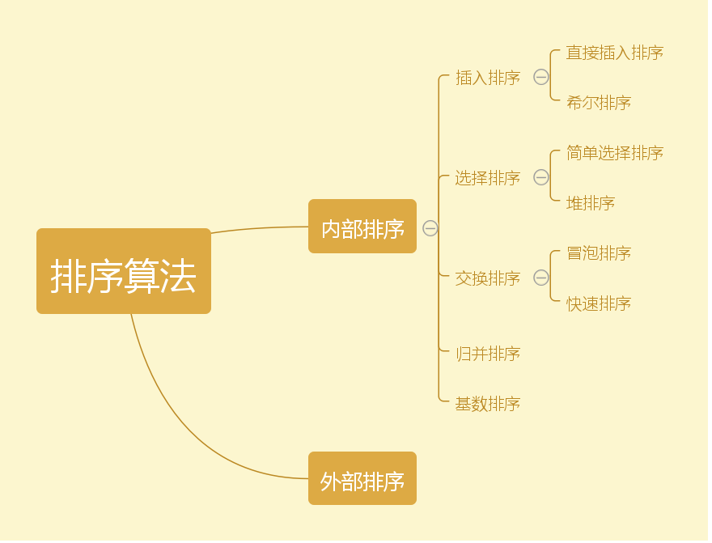

# 排序


| 类别 | 排序方法 | 平均情况 | 最好情况 | 最坏情况 | 存储辅助 | 稳定性 |
| ---- | ---- | ---- | ---- | ---- | ---- | ---- | ---- | ---- |
| 插入排序 | 直接插入 | $O(n^2)$ | $O(n)$ | $O(n^2)$ | $O(1)$ | 稳定 |
| 插入排序 | shell插入 | $O(n^1.3)$ | $O(n)$ | $O(n^2)$ | $O(1)$ | 不稳定 |
| 选择排序 | 直接选择 | $O(n^2)$ | $O(n^2)$ | $O(n^2)$ | $O(1)$ | 不稳定 |
| 选择排序 | 堆排序 | $O(nlog_2n)$ | $O(nlog_2n)$ | $O(nlog_2n)$ | $O(1)$ | 不稳定 |
| 交换排序 | 冒泡 | $O(n^2)$ | $O(n)$ | $O(n^2)$ | $O(1)$ | 稳定 |
| 交换排序 | 快速 | $O(nlog_2n)$ | $O(nlog_2n)$ | $O(n^2)$ | $O(nlog_2n)$ | 不稳定 |
|  | 归并排序 | $O(nlog_2n)$ | $O(nlog_2n)$ | $O(nlog_2n)$ | $O(1)$ | 稳定 |
|  | 基数排序 | $O(d(r+n))$ | $O(d(n+rd))$ | $O(d(r+n))$ | $O(rd+n)$ | 稳定 |

## 交换-冒泡排序bubble sort
重复地走访过要排序的元素列，依次比较两个相邻的元素，如果他们的顺序（如从大到小、首字母从A到Z）错误就把他们交换过来。走访元素的工作是重复地进行直到没有相邻元素需要交换，也就是说该元素已经排序完成。
这个算法的名字由来是因为越大的元素会经由交换慢慢“浮”到数列的顶端（升序或降序排列），就如同碳酸饮料中二氧化碳的气泡最终会上浮到顶端一样，故名“冒泡排序”。
### 复杂度
时间复杂度： $O(n^2)$

空间复杂度： $O(1)$
### 示例


### sample code
```
#冒泡排序
def bubble_sort(L):
    length = len(L)
    #序列长度为length，需要执行length-1轮交换
    for x in range(1,length):
        #对于每一轮交换，都将序列当中的左右元素进行比较
        #每轮交换当中，由于序列最后的元素一定是最大的，因此每轮循环到序列未排序的位置即可
        for i in range(0,length-x):
            if L[i] > L[i+1]:
                temp = L[i]
                L[i] = L[i+1]
                L[i+1] = temp
```

## 交换-快速排序
一趟快速排序的算法是：
1. 设置两个变量i、j，排序开始的时候：i=0，j=N-1；
2. 以第一个数组元素作为关键数据，赋值给pivot，即pivot=A[0]；
3. 从j开始向前搜索，即由后开始向前搜索(j--)，找到第一个小于pivot的值A[j]，将A[j]的值赋给A[i]；
4. 从i开始向后搜索，即由前开始向后搜索(i++)，找到第一个大于pivot的A[i]，将A[i]的值赋给A[j]；
5. 重复第3、4步，直到i=j，设置A[i]为pivot；
   
### 示例

### 复杂度
时间复杂度： $O(nlog_2n)$

空间复杂度： $O(nlog_2n)$
### sample code
```
#快速排序
#L：待排序的序列；start排序的开始index,end序列末尾的index
#对于长度为length的序列：start = 0;end = length-1
def quick_sort(L,start,end):
    if start < end:
        i , j , pivot = start , end , L[start]
        while i < j:
            #从右开始向左寻找第一个小于pivot的值
            while (i < j) and (L[j] >= pivot):
                j = j-1
            #将小于pivot的值移到左边
            if (i < j):
                L[i] = L[j]
                i = i+1 
            #从左开始向右寻找第一个大于pivot的值
            while (i < j) and (L[i] < pivot):
                i = i+1
            #将大于pivot的值移到右边
            if (i < j):
                L[j] = L[i]
                j = j-1
        #循环结束后，说明 i=j，此时左边的值全都小于pivot,右边的值全都大于pivot
        #pivot的位置移动正确，那么此时只需对左右两侧的序列调用此函数进一步排序即可
        #递归调用函数：依次对左侧序列：从0 ~ i-1//右侧序列：从i+1 ~ end
        L[i] = pivot
        #左侧序列继续排序
        quick_sort(L,start,i-1)
        #右侧序列继续排序
        quick_sort(L,i+1,end)
```

## 插入-直接插入
直接插入排序的核心思想就是：将数组中的所有元素依次跟前面已经排好的元素相比较，如果选择的元素比已排序的元素小，则交换，直到全部元素都比较过。
因此，从上面的描述中我们可以发现，直接插入排序可以用两个循环完成：

1. 第一层循环：遍历待比较的所有数组元素
2. 第二层循环：将本轮选择的元素(selected)与已经排好序的元素(ordered)相比较。
如果：selected > ordered，那么将二者交换
### 示例


### sample code
```
#直接插入排序
def insert_sort(L):
    #遍历数组中的所有元素，其中0号索引元素默认已排序，因此从1开始
    for x in range(1,len(L)):
        #将该元素与已排序好的前序数组依次比较，如果该元素小，则交换
        #range(x-1,-1,-1):从x-1倒序循环到0
        for i in range(x-1,-1,-1):
            #判断：如果符合条件则交换
            if L[i] > L[i+1]:
                temp = L[i+1]
                L[i+1] = L[i]
                L[i] = temp
```

## 插入-折半插入
设元素序列data[0],data[1],……data[n-1]。其中data[0],data[1],……data[i-1]是已经排好序的元素。在插入data[i]时，利用折半搜索法寻找data[i]的插入位置。 

## 插入-希尔排序（缩小增量排序）
将待排序数组按照步长gap进行分组，然后将每组的元素利用直接插入排序的方法进行排序；每次将gap折半减小，循环上述操作；当gap=1时，利用直接插入，完成排序。

### 示例

如上图，第一趟取间距gap为5，获得5个分组[9,4],[1,8],[2,6],[5,3],[7,5]，对各个分组应用插入排序，获得[4,9],[1,8],[2,6],[3,5],[5,7]，合并后即为[4,1,2,3,5,9,8,6,5,7]；第二轮取gap=gap//2，获得两组[4,2,5,8,5],[1,3,9,6,7]，对这两分组分别应用插入排序，获得[2,4,5,5,8],[1,3,6,7,9]，合并后为[2,1,4,3,5,6,5,7,8,0]；第二轮取gap=gap//1，获得一组，直接引用插入排序，获得最终结果[1,2,3,4,5,5,6,7,8,9]

### sample code
```
#希尔排序
def insert_shell(L):
    #初始化gap值，此处利用序列长度的一般为其赋值
    gap = (int)(len(L)/2)
    #第一层循环：依次改变gap值对列表进行分组
    while (gap >= 1):
        #下面：利用直接插入排序的思想对分组数据进行排序
        #range(gap,len(L)):从gap开始
        for x in range(gap,len(L)):
        #range(x-gap,-1,-gap):从x-gap开始与选定元素开始倒序比较，每个比较元素之间间隔gap
            for i in range(x-gap,-1,-gap):
                #如果该组当中两个元素满足交换条件，则进行交换
                if L[i] > L[i+gap]:
                    temp = L[i+gap]
                    L[i+gap] = L[i]
                    L[i] =temp
        #while循环条件折半
        gap = (int)(gap/2)
```

## 选择-直接选择
简单选择排序的基本思想：比较+交换。

1. 从待排序序列中，找到关键字最小的元素；
2. 如果最小元素不是待排序序列的第一个元素，将其和第一个元素互换；
3. 从余下的 N - 1 个元素中，找出关键字最小的元素，重复(1)、(2)步，直到排序结束。


### sample code
```
# 简单选择排序
def select_sort(L):
# 依次遍历序列中的每一个元素
    for x in range(0,len(L)):
        # 将当前位置的元素定义此轮循环当中的最小值
        minimum = L[x]
        # 将该元素与剩下的元素依次比较寻找最小元素
        for i in range(x+1,len(L)):
            if L[i] < minimum:
                temp = L[i];
                L[i] = minimum;
                minimum = temp
        #  将比较后得到的真正的最小值赋值给当前位置
        L[x] = minimum
```

## 选择-堆排序
堆通常是一个可以被看做一棵树的数组对象。堆总是满足下列性质：
- 堆中某个节点的值总是不大于或不小于其父节点的值；
- 堆总是一棵完全二叉树。

1. 首先将序列构建称为大顶堆
2. 取出当前大顶堆的根节点，将其与序列末尾元素进行交换
3. 对交换后的n-1个序列元素进行调整，使其满足大顶堆的性质
4. 重复步骤1-3

## 归并排序
归并排序（MERGE-SORT）是利用归并的思想实现的排序方法，该算法采用经典的分治（divide-and-conquer）策略（分治法将问题分(divide)成一些小的问题然后递归求解，而治(conquer)的阶段则将分的阶段得到的各答案"修补"在一起，即分而治之)。

## 示例


## 参考
- [1] [八大排序算法](https://www.cnblogs.com/hokky/p/8529042.html)
- [2] [冒泡排序](https://en.wikipedia.org/wiki/Bubble_sort)