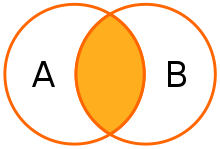
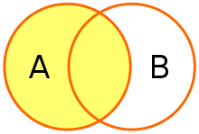
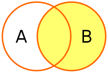
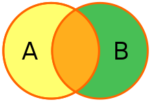

# SQL Join连接
一条sql join语句对应着关系代数里的一个join操作，它对关系数据库里一个或多个表的列进行合并。
ANSI标准的SQL规定了5种类型的Join：INNER,LEFT OUTER,RIGHT OUTER, FULL OUTER和CROSS。
除此之外一个表能够对自身进行连接，即self-join。

## 样例表
以下两表是后面章节描述所基于的表格
### 职员表
| 名字 | 部门id |
| ---- | ---- |
| Rafferty | 31 |
| Jones | 33 |
| Heisenberg | 33 |
| Robinson | 34 |
| Smith | 34 |
| Williams | NULL |
### 部门表
| 部门id | 部门名 |
| ---- | ---- |
| 31 | Sales |
| 33 | Engineering |
| 34 | Clerical |
| 35 | Marketing |

## Cross join交叉连接
Cross join交叉连接返回连接中表格各行的笛卡尔积，即[row1_1,row1_2]x[row2_1,row2_2]=>[(row1_1,row_2_1),(row1_1,row_2_2),(row1_2,row_2_1),(row1_2,row_2_2)]
### 显式语句
```  
SELECT *
FROM employee CROSS JOIN department;
```
### 隐式语句
```
SELECT *
FROM employee, department;
```

| 职员表.职员名	| 职员表.部门id	|部门表.部门名 | 部门表.部门id |
| ---- | ---- | ---- | ---- |
| Rafferty | 31 | Sales | 31 |
| Jones | 33 | Sales | 31 |
| Heisenberg | 33 | Sales | 31 |
| Smith | 34 | Sales | 31 |
| Robinson | 34 | Sales | 31 |
| Williams | NULL | Sales | 31 |
| Rafferty | 31 | Engineering | 33 |
| Jones | 33 | Engineering | 33 |
| Heisenberg | 33 | Engineering | 33 |
| Smith | 34 | Engineering | 33 |
| Robinson | 34 | Engineering | 33 |
| Williams | NULL | Engineering | 33 |
| Rafferty | 31 | Clerical | 34 |
| Jones | 33 | Clerical | 34 |
| Heisenberg | 33 | Clerical | 34 |
| Smith | 34 | Clerical | 34 |
| Robinson | 34 | Clerical | 34 |
| Williams | NULL | Clerical | 34 |
| Rafferty | 31 | Marketing | 35 |
| Jones | 33 | Marketing | 35 |
| Heisenberg | 33 | Marketing | 35 |
| Smith | 34 | Marketing | 35 |
| Robinson | 34 | Marketing | 35 |
| Williams | NULL | Marketing | 35 |
交叉联接本身并不应用任何谓词来筛选联接表中的行。交叉连接的结果可以通过使用WHERE子句进行过滤，该子句随后可能生成等效的内部连接。

## Inner Join内连接
内连接返回两个链接表中同时含有相符列值的行的组合



### 显式语句
```
SELECT employee.LastName, employee.DepartmentID, department.DepartmentName 
FROM employee 
INNER JOIN department ON
employee.DepartmentID = department.DepartmentID
```

| 职员表.职员名	| 职员表.部门id	| 部门表.部门id |
| ---- | ---- | ---- |
| Robinson | 34 | Clerical |
| Jones | 33 | Engineering |
| Smith | 34 | Clerical |
| Heisenberg | 33 | Engineering |
| Rafferty | 31 | Sales |

### 隐式语句
内连接的隐式表示方式：在SELECT语句的FROM子句中列出用于连接的表，并使用逗号分隔它们。如此，这种语句指定了交叉连接，WHERE子句可以应用额外的筛选器谓词
```
SELECT *
FROM employee, department
WHERE employee.DepartmentID = department.DepartmentID;
```
    

## 左外连接Left outer join
左向外联接的结果集包括  LEFT OUTER子句中指定的左表的所有行，而不仅仅是联接列所匹配的行。如果左表的某行在右表中没有匹配行，则在相关联的结果集行中右表的所有选择列表列均为空值。



```
SELECT *
FROM employee 
LEFT OUTER JOIN department ON employee.DepartmentID = department.DepartmentID;
```
| 职员表.职员名	| 职员表.部门id	| 部门表.部门名 | 部门表.部门id |
| ---- | ---- | ---- | ---- |
| Jones | 33 | Engineering | 33 |
| Rafferty | 31 | Sales | 31 |
| Robinson | 34 | Clerical | 34 |
| Smith | 34 | Clerical | 34 |
| Williams | NULL | NULL | NULL |
| Heisenberg | 33 | Engineering | 33 |

## 右外连接Right outer join
右向外联接是左向外联接的反向联接。将返回右表的所有行。如果右表的某行在左表中没有匹配行，则将为左表返回空值。   



```
SELECT *
FROM employee RIGHT OUTER JOIN department
  ON employee.DepartmentID = department.DepartmentID;
```

| 职员表.职员名	| 职员表.部门id	| 部门表.部门名 | 部门表.部门id |
| ---- | ---- | ---- | ---- |
| Smith | 34 | Clerical | 34 |
| Jones | 33 | Engineering | 33 |
| Robinson | 34 | Clerical | 34 |
| Heisenberg | 33 | Engineering | 33 |
| Rafferty | 31 | Sales | 31 |
| NULL | NULL | Marketing | 35 |

## 全（外）连接Full outer join
完整外部联接返回左表和右表中的所有行。当某行在另一个表中没有匹配行时，则另一个表的选择列表列包含空值。如果表之间有匹配行，则整个结果集行包含基表的数据值。  



```
# OUTER 关键字可选
SELECT *
FROM employee FULL OUTER JOIN department
  ON employee.DepartmentID = department.DepartmentID;
```

| 职员表.职员名	| 职员表.部门id	| 部门表.部门名 | 部门表.部门id |
| ---- | ---- | ---- | ---- |
| Smith | 34 | Clerical | 34 |
| Jones | 33 | Engineering | 33 |
| Robinson | 34 | Clerical | 34 |
| Williams | NULL | NULL | NULL |
| Heisenberg | 33 | Engineering | 33 |
| Rafferty | 31 | Sales | 31 |
| NULL | NULL | Marketing | 35 |

## 自连接Self-join
使用自身表格进行连接

```
SELECT F.EmployeeID, F.LastName, S.EmployeeID, S.LastName, F.Country
FROM Employee F INNER JOIN Employee S ON F.Country = S.Country
WHERE F.EmployeeID < S.EmployeeID
ORDER BY F.EmployeeID, S.EmployeeID;
```

## 参考
- [0] [wiki](https://en.wikipedia.org/wiki/Join_(SQL)#Cross_join)