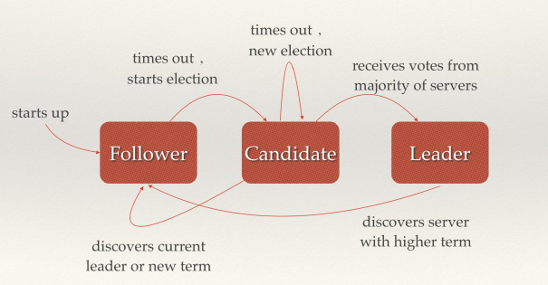

# RAFT共识算法 The Raft Consensus Algorithm
文章[1][2]详细阐述了RAFT算法。
## 状态
每个分布式网络节点有三种状态：Follower，Candidate，Leader，状态之间是互相转换的

leader 向 follower 同步日志，follower 只从 leader 处获取日志。在节点初始启动时，节点的 raft 状态机将处于 follower 状态并被设定一个 election timeout，如果在这一时间周期内没有收到来自 leader 的 heartbeat，节点将发起选举：节点在将自己的状态切换为 candidate 之后，向集群中其它 follower 节点发送请求，询问其是否选举自己成为 leader。当收到来自集群中过半数节点的接受投票后，节点即成为 leader，开始接收保存 client 的数据并向其它的 follower 节点同步日志。leader 节点依靠定时向 follower 发送 heartbeat 来保持其地位。任何时候如果其它 follower 在 election timeout 期间都没有收到来自 leader 的 heartbeat，同样会将自己的状态切换为 candidate 并发起选举。每成功选举一次，新 leader 的步进数都会比之前 leader 的步进数大 1。

## 选举
 一个 candidate 成为 leader 需要具备三个要素：
- 获得集群多数节点的同意；
- 集群中不存在比自己步进数term更高的 candidate；
- 集群中不存在其他 leader。

## 节点异常
集群中各个节点的状态随时都有可能发生变化。从实际的变化上来分类的话，节点的异常大致可以分为四种类型：
- leader 不可用；
- follower 不可用；
- 多个 candidate 或多个 leader；
- 新节点加入集群。

## 参考
- [1] [共识算法：raft](https://www.jianshu.com/p/8e4bbe7e276c)
- [2] [CoreOS 实战：剖析 etcd](https://www.infoq.cn/article/coreos-analyse-etcd)
- [3] [动画解析raft算法](http://thesecretlivesofdata.com/raft/)