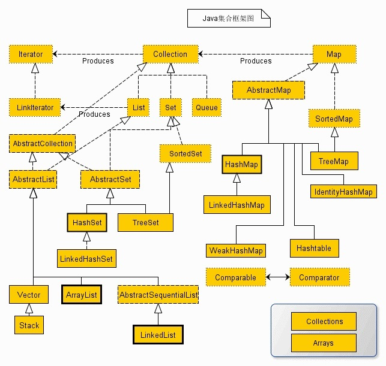

# 集合框架<sup>[1]</sup>
Java 集合框架是一个用来代表和操纵集合的统一架构。Java集合框架主要包括两种类型的容器，一种是集合（Collection），存储一个元素集合，另一种是图（Map），存储键/值对映射。Collection 接口又有 3 种子类型，List、Set 和 Queue，再下面是一些抽象类，最后是具体实现类，常用的有 ArrayList、LinkedList、HashSet、LinkedHashSet、HashMap、LinkedHashMap 等等。

Java 集合框架包含内容可划分为：

- 接口：是代表集合的抽象数据类型。例如 Collection、List、Set、Map 等。之所以定义多个接口，是为了以不同的方式操作集合对象

- 实现（类）：是集合接口的具体实现。从本质上讲，它们是可重复使用的数据结构，例如：ArrayList、LinkedList、HashSet、HashMap。

- 工具类（算法）：是实现集合接口的对象里的方法执行的一些有用的计算，例如：搜索和排序。




## 接口
Java集合接口包含Collection接口和Map接口，Collection接口又有子接口List、Set和Queue接口。其中Set代表无序、不可重复的集合；List代表有序、重复的集合；而Map则代表具有映射关系的集合。Java 5之后，增加了Queue体系集合，代表一种队列集合实现。

### Collection接口<sup>[2]</sup>


基本操作包括：
- add(Object o)：增加元素
- addAll(Collection c)：...
- clear()：...
- contains(Object o)：是否包含指定元素
- containsAll(Collection c)：是否包含集合c中的所有元素
- iterator()：返回Iterator对象，用于遍历集合中的元素
- remove(Object o)：移除元素
- removeAll(Collection c)：相当于减集合c
- retainAll(Collection c)：相当于求与c的交集
- size()：返回元素个数
- toArray()：把集合转换为一个数组
- Iterator iterator()返回一个迭代器

#### Collection-List
List主要对象
```
├── LinkedList没有同步方法
├── ArrayList非同步的（unsynchronized）
├── Vector(同步) 非常类似ArrayList，但是Vector是同步的 
│   └── Stack push和pop方法，peek方法得到栈顶的元素。
```

List的主要方法：

- void add(int index,Object element)在指定位置上添加一个对象
- boolean addAll(int index,Collection c)将集合c的元素添加到指定的位置
- Object get(int index)返回List中指定位置的元素
- int indexOf(Object o)返回第一个出现元素o的位置.
- Object remove(int index)删除指定位置的元素
- Object set(int index,Object element)用元素element取代位置index上的元素,返回被取代的元素
- void sort()

------

#### Collection-Set
Set主要对象
```
├── HashSet
│   └── LinkedHashSet
├── SortSet
│   └── TreeSet
├── EnumSet
```

Set主要方法
- add() 向集合中添加元素
- clear( )        去掉集合中所有的元素
- contains( )    判断集合中是否包含某一个元素
- isEmpty( )    判断集合是否为空
- remove( )    从集合中去掉特定的对象
- size( )        返回集合的大小

Set主要实现类

**HashSet**
> 此类实现Set接口，由哈希表（实际上是一个HashMap实例）支持。它不保证set的迭代顺序；特别是它不保证该顺序恒久不变。此类允许使用null元素。

**LinkedHashSet**

> LinkedHashSet类是具有可预知迭代顺序(相对有序)的Set接口的哈希表和链接列表实现。是HashSet的子类。

**TreeSet**
> TreeSet集合是可以给元素进行重新排序的一个Set接口的实现。使用元素的自然顺序对元素进行排序，或者根据创建 set 时提供的Comparator进行排序，具体取决于使用的构造方法。 

------
#### Collection-Queue
Queue主要对象
```
├── Deque
├── PriorutyQueue
├── xxBlockingQueue
```
**PriorityQueue**
> PriorityQueue保存队列元素的顺序不是按照元素添加的顺序来保存的，而是在添加元素的时候对元素的大小排序后再保存的。因此在PriorityQueue中使用peek()或pool()取出队列中头部的元素，取出的不是最先添加的元素，而是最小的元素。

**Deque**

> Deque是Queue的子接口,我们知道Queue是一种队列形式,而Deque则是双向队列,它支持从两个端点方向检索和插入元素,因此Deque既可以支持LIFO形式也可以支持LIFO形式.Deque接口是一种比Stack和Vector更为丰富的抽象数据形式,因为它同时实现了以上两者.

**BlockingQueue**
在java.util.concurrent包中包含了一系列的同步Queue接口和实类.BlockingQueue继承自Queue,它会在检索元素时等待队列是非空队列处于可用状态,并在存入一个元素后将状态更改为可用状态。

见[文档](./blocking-queue.md)

------

### Map接口<sup>[4]</sup>
Map没有继承Collection接口，Map提供key到value的映射。

Map主要方法
- boolean containsKey(Object key) 是否包含键key
- boolean containsValue(Object value) 是否包含值value
- boolean remove(Object o)删除一个对象
- V put(K key, V value)添加key和value。若key已存在返回value；否则返回null
- void putAll(Map<? extends K, ? extends V> m)将另一个Map对象复制到此对象中
- void Clear() 清空所有kv
- V get(Object key) 通过key查找value并返回，若无返回null
- Set<Map.Entry<K,V>> entrySet() 返回键值对的Set集
- Set<K> keySet() 返回key的Set集
- Collection<V> values() 返回value的Collection集
  
Map主要对象
- HashMap。最常用的Map,它根据键的HashCode 值存储数据,根据键可以直接获取它的值，具有很快的访问速度。HashMap最多只允许一条记录的键为Null(多条会覆盖);允许多条记录的值为 Null。非同步的。
- TreeMap。 能够把它保存的记录根据键(key)排序,默认是按升序排序，也可以指定排序的比较器，当用Iterator 遍历TreeMap时，得到的记录是排过序的。TreeMap不允许key的值为null。非同步的。 
- Hashtable 与 HashMap类似,不同的是:key和value的值均不允许为null;它支持线程的同步，即任一时刻只有一个线程能写Hashtable,因此也导致了Hashtale在写入时会比较慢。
- LinkedHashMap。保存了记录的插入顺序，在用Iterator遍历LinkedHashMap时，先得到的记录肯定是先插入的.在遍历的时候会比HashMap慢。key和value均允许为空，非同步的。 
  
## 工具类
### Collections工具类<sup>[3]</sup>
Collections是集合类的一个工具类/帮助类，其中提供了一系列静态方法，用于对集合中元素进行排序、搜索以及线程安全等各种操作。

### 排序
- void reverse(List list)：反转
- void shuffle(List list),随机排序
- void sort(List list),按自然排序的升序排序
- void sort(List list, Comparator c);定制排序，由Comparator控制排序逻辑
- void swap(List list, int i , int j),交换两个索引位置的元素
- void rotate(List list, int distance),旋转。当distance为正数时，将list后distance个元素整体移到前面。当distance为负数时，将 list的前distance个元素整体移到后面。

### 查找，替换操作
- int binarySearch(List list, Object key), 对List进行二分查找，返回索引，注意List必须是有序的
- int max(Collection coll),根据元素的自然顺序，返回最大的元素。 类比int min(Collection coll)
- int max(Collection coll, Comparator c)，根据定制排序，返回最大元素，排序规则由Comparatator类控制。类比int min(Collection coll, Comparator c)
- void fill(List list, Object obj),用元素obj填充list中所有元素
- int frequency(Collection c, Object o)，统计元素出现次数
- int indexOfSubList(List list, List target), 统计targe在list中第一次出现的索引，找不到则返回-1，类比int lastIndexOfSubList(List source, list target).
- boolean replaceAll(List list, Object oldVal, Object newVal), 用新元素替换旧元素。

### 同步控制
Collections中几乎对每个集合都定义了同步控制方法，例如 SynchronizedList(), SynchronizedSet()等方法，来将集合包装成线程安全的集合。
- synchronizedCollection
- synchronizedList
- synchronizedSet

### 设置不可变（只读）集合
Collections提供了三类方法返回一个不可变集合，对返回的集合执行add/put/...等添加操作时，会抛出java.lang.UnsupportedOperationException异常。

- emptyXXX(),返回一个空的只读集合（这不知用意何在？）
- singleXXX()，返回一个只包含指定对象，只有一个元素，只读的集合。
- unmodifiablleXXX()，返回指定集合对象的只读视图。


## 参考
- [1] [Java 集合框架](https://www.runoob.com/java/java-collections.html)
- [2] [Java：集合，Collection接口框架图](https://www.cnblogs.com/nayitian/p/3266090.html)
- [3] [JAVA基础知识之Collections工具类](https://www.cnblogs.com/fysola/p/6021134.html)
- [4] [Java map 详解 - 用法、遍历、排序、常用API等](https://www.cnblogs.com/lzq198754/p/5780165.html)
