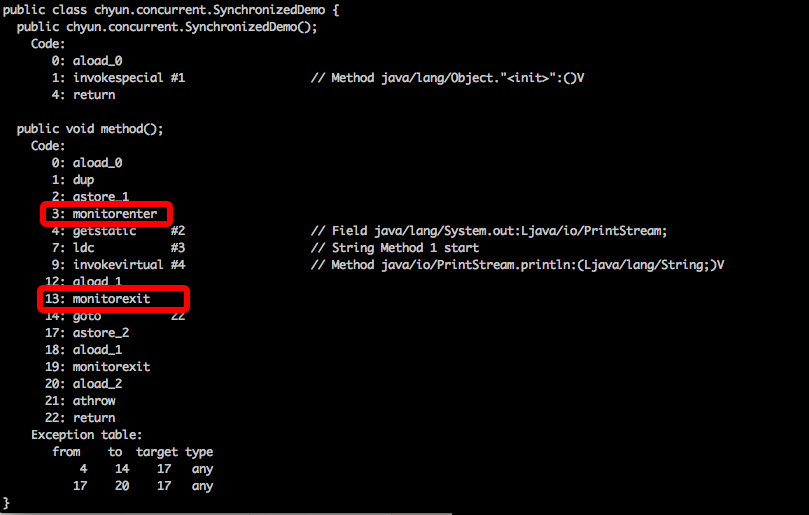
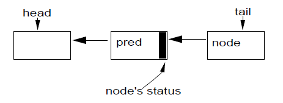

# java.util.concurrent并发框架解析
**转载自 https://www.jianshu.com/p/bff4ffb34e00**
## 1. 概述
在jdk1.4以前,java的内置锁(使用synchronized的方法或代码块)性能问题一直都在被人们关注.jdk1.5中加入了java.concurrent.util包, 来实现高性能的同步器(如ReentrantLock, CountDownLatch等)。

java.util.concurrent包的目的有两个：1.提升性能(相比于synchronized)； 2.实现同步器的基本功能(acquire和release)。

那么, java.util.concurrent包是如何达到以上两个目的的呢? 主要从两方面着手:
1. jdk1.5中提供了硬件级别的同步原语(compareAndSwap)来提高同步效率;
2. 在java层面提供了一个设计良好的抽象同步器AbstractQueuedSynchronizer。 java.concurrent.util包中所有的同步器(ReentrantLock，CountDownLatch等)都基于这个抽象类。
   
本文将首先介绍compareAndSwap相比于synchronized的优势，接着介绍一下框架核心AbstractQueuedSync的结构，最后简述一下java.util.concurrent包中的若干个同步器。

## 2. java.concurrent.util包实现原理
### 2.1 同步原语synchronized 和 CAS
#### 2.1.1 synchronized
jdk1.4以前, java用内置锁(synchronized)来实现同步。 这种方式是非常低效的, 为什么? 来看一下原因。
我们可以通过反编译原来来看一下synchronized在class文件中的指令。 先编写一个类。
```
public class SynchronizedDemo {
    public void method() {
        synchronized (this) {
            System.out.println("Method 1 start");
        }
    }
}
```

反编译结果



可以看到synchronized是通过monitorenter和monitorexit两条指令来实现的,
关于这两条指令的作用，我们直接参考JVM规范中描述.

**monitorenter**
```
Each object is associated with a monitor. A monitor is locked if and only if it has an owner. The thread that executes monitorenter attempts to gain ownership of the monitor associated with objectref, as follows:
• If the entry count of the monitor associated with objectref is zero, the thread enters the monitor and sets its entry count to one. The thread is then the owner of the monitor.
• If the thread already owns the monitor associated with objectref, it reenters the monitor, incrementing its entry count.
• If another thread already owns the monitor associated with objectref, the thread blocks until the monitor's entry count is zero, then tries again to gain ownership.
```


每个对象有一个“管程”（monitor）。当monitor被占用时就会处于锁定状态，线程执行monitorenter指令时尝试获取monitor的所有权，过程如下：

1. 如果monitor的进入数为0，则该线程进入monitor，然后将进入数设置为1，该线程即为monitor的所有者；
2. 如果线程已经占有该monitor，只是重新进入，则进入monitor的进入数加1；
3. 如果其他线程已经占用了monitor，则该线程进入阻塞状态，直到monitor的进入数为0，再重新尝试获取monitor的所有权。

**monitorexit**
```
The thread that executes monitorexit must be the owner of the monitor associated with the instance referenced by objectref.
The thread decrements the entry count of the monitor associated with objectref. If as a result the value of the entry count is zero, the thread exits the monitor and is no longer its owner. Other threads that are blocking to enter the monitor are allowed to attempt to do so.
```

执行monitorexit的线程必须是objectref所对应的monitor的所有者。
指令执行时，monitor的进入数减1，如果减1后进入数为0，那线程退出monitor，不再是这个monitor的所有者.其他被这个monitor阻塞的线程可以尝试去获取这个 monitor 的所有权。

Synchronized的语义底层是通过一个monitor的对象来完成，其实wait/notify等方法也依赖于monitor对象，这就是为什么只有在同步的块或者方法中才能调用wait/notify等方法，否则会抛出java.lang.IllegalMonitorStateException的异常的原因。

我们可以用同样的方法查看同步方法（方法前用Synchronized修饰）的原理此处不在论述。

大致上我们可以认为, Synchronized提供的锁是悲观锁, 并且是在java指令层面实现的。

#### 2.1.2 CAS
以AtomicInteger为例, 其incrementAndGet的源码如下:
```
public final int incrementAndGet() {
        for (;;) {
            int current = get();
            int next = current + 1;
            if (compareAndSet(current, next))
                return next;
        }
}
public final boolean compareAndSet(int expect, int update) {
        return unsafe.compareAndSwapInt(this, valueOffset, expect, update);
}
/**
  * Atomically update Java variable to <tt>x</tt> if it is currently
  * holding <tt>expected</tt>.
  * @return <tt>true</tt> if successful
  */
public final native boolean compareAndSwapInt(Object o, long offset,int expected,int x);
```
跟踪代码发现其底层实现为unsafe.compareAndSwapInt(), 其底层的原子性由cpu提供。与synchronized不同, java.util.concurent包中的同步器一般使用**乐观锁**（采用CAS的方式）, 并且提供硬件级别的同步原语来提升性能。

### 2.2 AbstractQueuedSynchronizer
java.util.concurrent包为所有应用层的同步器提供了一个抽象类AbstractQueuedSynchronizer， 其余同步器只需继承该类即可实现一个高性能的同步器。同步器背后的基本思想非常简单, 只需两个操作**acquire**(获取资源)和**release**(释放资源)。

其伪代码如下:
```
[acquire]:
while (synchronization state does not allow acquire) {
    enqueue current thread if not already queued;
    possibly block current thread;
}
dequeue current thread if it was queued;

[release]:
update synchronization state;
if (state may permit a blocked thread to acquire)
    unblock one or more queued threads;
```
为了实现上述操作，需要下面三个基本组件的相互协作：
- 同步状态的原子性管理；
- 线程的阻塞与解除阻塞；
- 队列的管理;

#### 2.2.1 同步状态
AQS类使用单个int（32位）来保存同步状态，并暴露出getState、setState以及compareAndSet操作来读取和更新这个状态。这些方法都依赖于j.u.c.atomic包的支持，这个包提供了兼容JSR133中volatile在读和写上的语义，并且通过使用本地的compare-and-swap或load-linked/store-conditional指令来实现compareAndSetState，使得仅当同步状态拥有一个期望值的时候，才会被原子地设置成新值。

基于AQS的具体实现类必须根据暴露出的状态相关的方法定义tryAcquire和tryRelease方法，以控制acquire和release操作。当同步状态满足时，tryAcquire方法必须返回true，而当新的同步状态允许后续acquire时，tryRelease方法也必须返回true。这些方法都接受一个int类型的参数用于传递想要的状态。例如：可重入锁中，当某个线程从条件等待中返回，然后重新获取锁时，为了重新建立循环计数的场景。很多同步器并不需要这样一个参数，因此忽略它即可。

#### 2.2.2 阻塞
在JSR166之前，阻塞线程和解除线程阻塞都是基于Java内置管程，没有其它非基于Java内置管程的API可以用来创建同步器。唯一可以选择的是Thread.suspend和Thread.resume，但是它们都有无法解决的竞态问题，所以也没法用：当一个非阻塞的线程在一个正准备阻塞的线程调用suspend前调用了resume，这个resume操作将不会有什么效果。

j.u.c包有一个LockSuport类，这个类中包含了解决这个问题的方法。方法LockSupport.park阻塞当前线程除非/直到有个LockSupport.unpark方法被调用（unpark方法被提前调用也是可以的）。unpark的调用是没有被计数的，因此在一个park调用前多次调用unpark方法只会解除一个park操作。另外，它们作用于每个线程而不是每个同步器。一个线程在一个新的同步器上调用park操作可能会立即返回，因为在此之前可能有“剩余的”unpark操作。但是，在缺少一个unpark操作时，下一次调用park就会阻塞。虽然可以显式地消除这个状态，但并不值得这样做。在需要的时候多次调用park会更高效。

这个简单的机制与有些用法在某种程度上是相似的，例如Solaris-9的线程库，WIN32中的“可消费事件”，以及Linux中的NPTL线程库。因此最常见的运行Java的平台上都有相对应的有效实现。（但目前Solaris和Linux上的Sun Hotspot JVM参考实现实际上是使用一个pthread的condvar来适应目前的运行时设计的）。park方法同样支持可选的相对或绝对的超时设置，以及与JVM的Thread.interrupt结合--可通过中断来unpark一个线程。

#### 2.2.3 队列
整个框架的关键就是如何管理被阻塞的线程的队列，该队列是严格的FIFO队列，因此，框架不支持基于优先级的同步。

AQS维护一个CLH链表队列, 通过两个字段head和tail来存取, 这两个字段是可原子更新的, 两者在初始化时都指向了一个空节点。



一个新的节点，node，通过一个原子操作入队：
```
do {
    pred = tail; // 让tail作为新加入node的前驱
} while(!tail.compareAndSet(pred, node)); // 判断tail是不是pred，是则替换为node
```

每一个节点的“释放”状态都保存在其前驱节点中. 因此AQS作为自旋锁的"自旋"操作就如下：

```
while (pred.status != RELEASED); // 自旋直到前驱状态为RELEASED
```

自旋后的出队操作只需将head字段指向刚刚得到锁的节点：

```
head = node;
```
CLH锁的优点在于其入队和出队操作是快速、无锁的，以及无障碍的（即使在竞争下，某个线程总会赢得一次插入机会而能继续执行）；且探测是否有线程正在等待也很快（只要测试一下head是否与tail相等）；同时，“释放”状态是分散的，避免了一些不必要的内存竞争。

在原始版本的CLH锁中，节点间甚至都没有互相链接。自旋锁中，pred变量可以是一个局部变量。然而，Scott和Scherer证明了通过在节点中显式地维护前驱节点，CLH锁就可以处理“超时”和各种形式的“取消”：如果一个节点的前驱节点取消了，这个节点就可以滑动去使用前面一个节点的状态字段。

为了将CLH队列用于阻塞式同步器，需要做些额外的修改以提供一种高效的方式定位某个节点的后继节点。在自旋锁中，一个节点只需要改变其状态，下一次自旋中其后继节点就能注意到这个改变，所以节点间的链接并不是必须的。但在阻塞式同步器中，一个节点需要显式地唤醒（unpark）其后继节点。

AQS队列的节点包含一个next链接到它的后继节点。但是，由于没有针对双向链表节点的类似compareAndSet的原子性无锁插入指令，因此这个next链接的设置并非作为原子性插入操作的一部分，而仅是在节点被插入后简单地赋值：

```
pred.next = node;
```
next链接仅是一种优化。如果通过某个节点的next字段发现其后继结点不存在（或看似被取消了），总是可以使用pred字段从尾部开始向前遍历来检查是否真的有后续节点。

第二个对CLH队列主要的修改是将每个节点都有的状态字段用于控制阻塞而非自旋。在同步器框架中，仅在线程调用具体子类中的tryAcquire方法返回true时，队列中的线程才能从acquire操作中返回；而单个“released”位是不够的。但仍然需要做些控制以确保当一个活动的线程位于队列头部时，仅允许其调用tryAcquire；这时的acquire可能会失败，然后（重新）阻塞。这种情况不需要读取状态标识，因为可以通过检查当前节点的前驱是否为head来确定权限。与自旋锁不同，读取head以保证复制时不会有太多的内存竞争（ there is not enough memory contention reading head to warrant replication.）。然而，“取消”状态必须存在于状态字段中.

队列节点的状态字段也用于避免没有必要的park和unpark调用。虽然这些方法跟阻塞原语一样快，但在跨越Java和JVM runtime以及操作系统边界时仍有可避免的开销。在调用park前，线程设置一个“唤醒（signal me）”位，然后再一次检查同步和节点状态。一个释放的线程会清空其自身状态。这样线程就不必频繁地尝试阻塞，特别是在锁相关的类中，这样会浪费时间等待下一个符合条件的线程去申请锁，从而加剧其它竞争的影响。除非后继节点设置了“唤醒”位，否则这也可避免正在release的线程去判断其后继节点。这反过来也消除了这些情形：除非“唤醒”与“取消”同时发生，否则必须遍历多个节点来处理一个似乎为null的next字段。

同步框架中使用的CLH锁的变体与其他语言中的相比，主要区别可能是同步框架中使用的CLH锁需要依赖垃圾回收管理节点的内存，这就避免了一些复杂性和开销。但是，即使依赖GC也仍然需要在确定链接字段不再需要时将其置为null。这往往可以与出队操作一起完成.否则，无用的节点仍然可触及，它们就没法被回收。

其它一些更深入的微调，包括CLH队列首次遇到竞争时才需要的初始空节点的延迟初始化等，都可以在J2SE1.5的版本的源代码文档中找到相应的描述。

基本的acquire操作的最终实现的一般形式如下（互斥，非中断，无超时）：
```
if(!tryAcquire(arg)) {
    node = create and enqueue new node;
    pred = node's effective predecessor;
    while (pred is not head node || !tryAcquire(arg)) {
        if (pred's signal bit is set)
            park()
        else
            compareAndSet pred's signal bit to true;
        pred = node's effective predecessor;
    }
    head = node;
}
```

release操作：
```
if(tryRelease(arg) && head node's signal bit is set) {
    compareAndSet head's bit to false;
    unpark head's successor, if one exist
}
```
acquire操作的主循环次数依赖于具体实现类中tryAcquire的实现方式。另一方面，在没有“取消”操作的情况下，每一个组件的acquire和release都是一个O(1)的操作，忽略park中发生的所有操作系统线程调度。

支持“取消”操作主要是要在acquire循环里的park返回时检查中断或超时。由超时或中断而被取消等待的线程会设置其节点状态，然后unpark其后继节点。在有“取消”的情况下，判断其前驱节点和后继节点以及重置状态可能需要O(n)的遍历（n是队列的长度）。由于“取消”操作，该线程再也不会被阻塞，节点的链接和状态字段可以被快速重建。

#### 2.2.4 条件队列
AQS框架提供了一个ConditionObject类，给维护独占同步的类以及实现Lock接口的类使用。一个锁对象可以关联任意数目的条件对象，可以提供典型的管程风格的await、signal和signalAll操作，包括带有超时的，以及一些检测、监控的方法。

通过修正一些设计决策，ConditionObject类有效地将条件（conditions）与其它同步操作结合到了一起。该类只支持Java风格的管程访问规则，这些规则中，仅当当前线程持有锁且要操作的条件（condition）属于该锁时，条件操作才是合法的。这样，一个ConditionObject关联到一个 ReentrantLock 上就表现的跟内置的管程（通过Object。wait等）一样了。两者的不同仅仅在于方法的名称、额外的功能以及用户可以为每个锁声明多个条件。

ConditionObject使用了与同步器一样的内部队列节点。但是，是在一个单独的条件队列中维护这些节点的。signal操作是通过将节点从条件队列转移到锁队列中来实现的，而没有必要在需要唤醒的线程重新获取到锁之前将其唤醒。

基本的await操作如下：
```
create and add new node to conditon queue;
release lock;
block until node is on lock queue;
re-acquire lock;
```
signal操作如下：
```
transfer the first node from condition queue to lock queue;

```

因为只有在持有锁的时候才能执行这些操作，因此他们可以使用顺序链表队列操作来维护条件队列（在节点中用一个nextWaiter字段）。转移操作仅仅把第一个节点从条件队列中的链接解除，然后通过CLH插入操作将其插入到锁队列上。

为了维护适当的顺序，队列节点状态变量中的一个位记录了该节点是否已经（或正在）被转移。“唤醒”和“取消”相关的代码都会尝试用compareAndSet修改这个状态。如果某次signal操作修改失败，就会转移队列中的下一个节点（如果存在的话）。如果某次“取消”操作修改失败，就必须中止此次转移，然后等待重新获得锁。后面的情况采用了一个潜在的无限的自旋等待。在节点成功的被插到锁队列之前，被“取消”的等待不能重新获得锁，所以必须自旋等待CLH队列插入（即compareAndSet操作）被“唤醒”线程成功执行。这里极少需要自旋，且自旋里使用Thread.yield来提示应该调度某一其它线程，理想情况下就是执行signal的那个线程。虽然有可能在这里为“取消”实现一个帮助策略以帮助插入节点，但这种情况实在太少，找不到合适的理由来增加这些开销。在其它所有的情况下，这个基本的机制都不需要自旋或yield，因此在单处理器上保持着合理的性能。

## 3. 利用AQS实现同步器
AQS已经定义了同步器的基本功能, 要实现一个应用层面的同步器, 只需要继承该类并实现tryAcquire和tryRelease方法即可。

下面是一个最简单的Mutex类的实现，它使用同步状态0表示解锁，1表示锁定。这个类并不需要同步方法中的参数，因此这里在调用的时候使用0作为实参，方法实现里将其忽略。

```
class Mutex {
    class Sync extends AbstractQueuedSynchronizer {
        public boolean tryAcquire(int ignore) {
            return compareAndSetState(0, 1);
        }
        public boolean tryRelease(int ignore) {
            setState(0); return true;
        }
    }

    private final Sync sync = new Sync();
    public void lock() { sync.acquire(0); }
    public void unlock() { sync.release(0); }
}
```

下面是java.util.concurrent包中同步器定义方式的概述：

### 3.1 ReentrantLock类
ReentrantLock类使用AQS同步状态来保存锁（重复）持有的次数。当锁被一个线程获取时，ReentrantLock也会记录下当前获得锁的线程标识，以便检查是否是重复获取，以及当错误的线程（译者注：如果线程不是锁的持有者，在此线程中执行该锁的unlock操作就是非法的）试图进行解锁操作时检测是否存在非法状态异常。ReentrantLock也使用了AQS提供的ConditionObject，还向外暴露了其它监控和监测相关的方法。ReentrantLock通过在内部声明两个不同的AbstractQueuedSynchronizer实现类（提供公平模式的那个禁用了闯入策略）来实现可选的公平模式，在创建ReentrantLock实例的时候根据设置（译者注：即ReentrantLock构造方法中的fair参数）使用相应的AbstractQueuedSynchronizer实现类。

### 3.2 ReentrantReadWriteLock类
ReentrantReadWriteLock类使用AQS同步状态中的16位来保存写锁持有的次数，剩下的16位用来保存读锁的持有次数。WriteLock的构建方式同ReentrantLock。ReadLock则通过使用acquireShared方法来支持同时允许多个读线程。

### 3.3 Semaphore类
Semaphore类（计数信号量）使用AQS同步状态来保存信号量的当前计数。它里面定义的acquireShared方法会减少计数，或当计数为非正值时阻塞线程；tryRelease方法会增加计数，可能在计数为正值时还要解除线程的阻塞。

### 3.4 CountDownLatch类
CountDownLatch类使用AQS同步状态来表示计数。当该计数为0时，所有的acquire操作（译者注：acquire操作是从aqs的角度说的，对应到CountDownLatch中就是await方法）才能通过。

### 3.5 FutureTask类
FutureTask类使用AQS同步状态来表示某个异步计算任务的运行状态（初始化、运行中、被取消和完成）。设置（译者注：FutureTask的set方法）或取消（译者注：FutureTask的cancel方法）一个FutureTask时会调用AQS的release操作，等待计算结果的线程的阻塞解除是通过AQS的acquire操作实现的。

### 3.6 SynchronousQueues类
SynchronousQueues类（一种CSP（Communicating Sequential Processes）形式的传递）使用了内部的等待节点，这些节点可以用于协调生产者和消费者。同时，它使用AQS同步状态来控制当某个消费者消费当前一项时，允许一个生产者继续生产，反之亦然。

## 4. 总结
总而言是, java.util.concurrent包中的同步框架使用硬件级别的同步原语和CAS的方式提升了java内置同步工具synchronized的性能, 另外还提供了一个AQS框架, 是的实现一个高性能的同步器变得非常方便, 只需继承AQS, 并实现tryAcquire和tryRelease方法即可。


## 参考
- [1] [java.util.concurrent并发框架解析](https://www.jianshu.com/p/bff4ffb34e00)