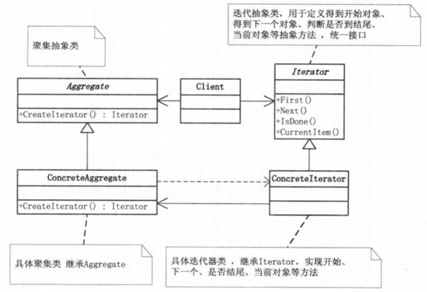

# Java 迭代器
Java集合框架的集合类，我们有时候称之为容器。容器的种类有很多种，比如ArrayList、LinkedList、HashSet...，每种容器都有自己的特点，ArrayList底层维护的是一个数组；LinkedList是链表结构的；HashSet依赖的是哈希表，每种容器都有自己特有的数据结构。

因为容器的内部结构不同，很多时候可能不知道该怎样去遍历一个容器中的元素。所以为了使对容器内元素的操作更为简单，Java引入了迭代器模式！ 

把访问逻辑从不同类型的集合类中抽取出来，从而避免向外部暴露集合的内部结构。

下面两段代码分别对“数组”和“ArrayList”进行遍历，可以看见这种遍历方式是与被遍历对象的类型紧密耦合，无法将访问逻辑从集合类和客户端代码中分离出来。不同的集合会对应不同的遍历方法，客户端代码无法复用。在实际应用中如何将上面两个集合整合是相当麻烦的。所以才有Iterator，它总是用同一种逻辑来遍历集合。使得客户端自身不需要来维护集合的内部结构，所有的内部状态都由Iterator来维护。客户端不用直接和集合进行打交道，而是控制Iterator向它发送向前向后的指令，就可以遍历集合。
```
// 遍历数组
int array[] = new int[3];    
for (int i = 0; i < array.length; i++) {
    System.out.println(array[i]);
}
```
```
// 遍历ArrayList
List<String> list = new ArrayList<String>();
for(int i = 0 ; i < list.size() ;  i++){
    String string = list.get(i);
}
```

## 迭代器模式
迭代器模式：提供一种方法顺序的访问一个聚合对象中各个元素，而又不暴露该对象的内部表示。



聚集类：Aggregate(抽象类)和ConcreteAggregate(具体聚集类)表示聚集类，是用来存储迭代器的数据。在Aggregate(抽象类)中有一个CreateIterator方法，用来获取迭代器

迭代器：迭代器用来为聚集类提供服务，提供了一系列访问聚集类对象元素的方法。

## java.util.Iterator接口
在Java中Iterator为一个接口，它只提供了迭代的基本规则。在JDK中它是这样定义的：对Collection进行迭代的迭代器。

```
package java.util;
public interface Iterator<E> {
    boolean hasNext();//判断是否存在下一个对象元素

    E next();//获取下一个元素

    void remove();//移除元素
}
```

## java.lang.Iterable接口
Java中还提供了一个Iterable接口，Iterable接口实现后的功能是‘返回’一个迭代器，我们常用的实现了该接口的子接口有:Collection<E>、List<E>、Set<E>等。该接口的iterator()方法返回一个标准的Iterator实现。实现Iterable接口允许对象成为Foreach语句的目标。就可以通过foreach语句来遍历你的底层序列。

Iterable接口包含一个能产生Iterator对象的方法，并且Iterable被foreach用来在序列中移动。因此如果创建了实现Iterable接口的类，都可以将它用于foreach中。

```
Package java.lang;

import java.util.Iterator;
public interface Iterable<T> {
    Iterator<T> iterator();
}

```

## 使用迭代器遍历集合

```
// 使用迭代器
Iterator<String> itr = collection.iterator();
while(itr.hasNext()){
    System.out.println(itr.next());
}
```
```
// 使用foreach
for (String text : collection) {
    System.out.println(text);
}
```
```
// 传统for循环
List<String> list = new ArrayList<String>();
for(int i = 0 ; i < list.size() ;  i++){
    String string = list.get(i);
}
```

对比for循环和迭代器：
- ArrayList对随机访问比较快，而for循环中使用的get()方法，采用的即是随机访问的方法，因此在ArrayList里for循环快。
- LinkedList则是顺序访问比较快，Iterator中的next()方法采用的是顺序访问方法，因此在LinkedList里使用Iterator较快。
- 主要还是要依据集合的数据结构不同的判断。

## Iterator遍历时不可以删除集合中的元素问题
在你迭代之前，迭代器已经被通过Iterator.itertor()创建出来了，如果在迭代的过程中，又对容器进行了改变其容器大小的操作，那么Java就会给出ConcurrentModificationException异常。

下面的代码块中是用于List的Iterator实现
```
// AbstractList.Itr类
private class Itr implements Iterator<E> {
    /**
        * Index of element to be returned by subsequent call to next.
        */
    int cursor = 0;

    /**
        * Index of element returned by most recent call to next or
        * previous.  Reset to -1 if this element is deleted by a call
        * to remove.
        */
    int lastRet = -1;

    /**
        * The modCount value that the iterator believes that the backing
        * List should have.  If this expectation is violated, the iterator
        * has detected concurrent modification.
        */
    int expectedModCount = modCount;

    public boolean hasNext() {
        return cursor != size();
    }

    public E next() {
        checkForComodification();
        try {
            int i = cursor;
            E next = get(i);
            lastRet = i;
            cursor = i + 1;
            return next;
        } catch (IndexOutOfBoundsException e) {
            checkForComodification();
            throw new NoSuchElementException();
        }
    }

    public void remove() {
        if (lastRet < 0)
            throw new IllegalStateException();
        checkForComodification();

        try {
            AbstractList.this.remove(lastRet);
            if (lastRet < cursor)
                cursor--;
            lastRet = -1;
            expectedModCount = modCount;
        } catch (IndexOutOfBoundsException e) {
            throw new ConcurrentModificationException();
        }
    }

    final void checkForComodification() {
        if (modCount != expectedModCount)
            throw new ConcurrentModificationException();
    }
}
```

通过查看源码发现原来检查并抛出异常的是checkForComodification()方法。在ArrayList中modCount是当前集合的版本号，每次修改(增、删)集合都会加1；expectedModCount是当前迭代器的版本号，在迭代器实例化时初始化为modCount。我们看到在checkForComodification()方法中就是在验证modCount的值和expectedModCount的值是否相等，所以当你在调用了ArrayList.add()或者ArrayList.remove()时，只更新了modCount的状态，而迭代器中的expectedModCount未同步，因此才会导致再次调用Iterator.next()方法时抛出异常。但是为什么使用Iterator.remove()就没有问题呢？通过源码的第32行发现，在Iterator的remove()中同步了expectedModCount的值，所以当你下次再调用next()的时候，检查不会抛出异常。

　　使用该机制的主要目的是为了实现ArrayList中的快速失败机制（fail-fast），在Java集合中较大一部分集合是存在快速失败机制的。

　　快速失败机制产生的条件:当多个线程对Collection进行操作时，若其中某一个线程通过Iterator遍历集合时，该集合的内容被其他线程所改变，则会抛出ConcurrentModificationException异常。

　　所以要保证在使用Iterator遍历集合的时候不出错误，就应该保证在遍历集合的过程中不会对集合产生结构上的修改。

## 参考
- [1] [深入理解Java中的迭代器](https://www.cnblogs.com/zyuze/p/7726582.html)
- [2] [迭代器模式](https://www.cnblogs.com/cxxjohnson/p/6403851.html)