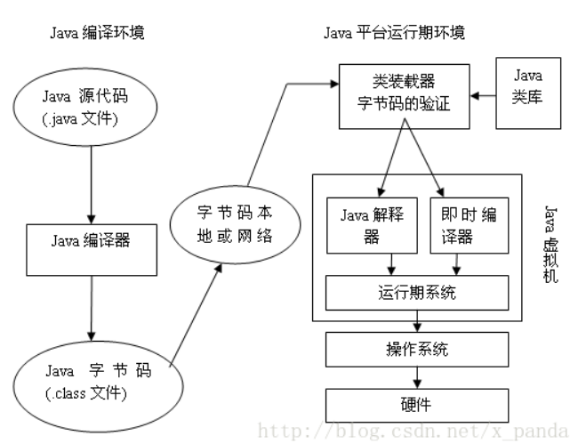
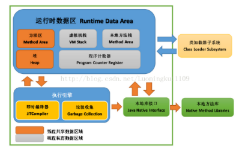
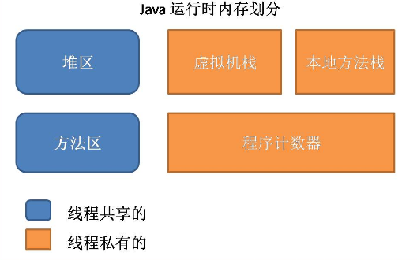

# JVM内存结构
## java代码编译执行过程
1. 源码编译：通过Java源码编译器将Java代码编译成JVM字节码（.class文件）
2. 类加载：通过ClassLoader及其子类来完成JVM的类加载
3. 类执行：字节码被装入内存，进入JVM虚拟机，被解释器解释执行

## JVM 体系结构

### Class Loader类加载器
负责加载 .class文件，class文件在文件开头有特定的文件标示，并且ClassLoader负责class文件的加载等，至于它是否可以运行，则由Execution Engine决定。

- ① 定位和导入二进制class文件
- ② 验证导入类的正确性
- ③ 为类分配初始化内存
- ④ 帮助解析符号引用.
### Native Interface本地接口
　　本地接口的作用是融合不同的编程语言为Java所用，它的初衷是融合C/C++程序，Java诞生的时候C/C++横行的时候，要想立足，必须有调用C/C++程序，于是就在内存中专门开辟了一块区域处理标记为native的代码，它的具体作法是Native Method Stack中登记native方法，在Execution Engine执行时加载native libraies。

　　目前该方法使用的越来越少了，除非是与硬件有关的应用，比如通过Java程序驱动打印机，或者Java系统管理生产设备，在企业级应用中已经比较少见。
　　因为现在的异构领域间的通信很发达，比如可以使用Socket通信，也可以使用Web Service等。
### Execution Engine 执行引擎
执行包在装载类的方法中的指令，也就是方法。
### Runtime data area 运行数据区（即：虚拟机内存或者JVM内存 下节介绍）
从整个计算机内存中开辟一块内存存储Jvm需要用到的对象，变量等，分为：方法区，堆，虚拟机栈，程序计数器，本地方法栈。

## JVM 内存结构

### 1.程序计数器 PC Register

　　每个线程都有一个程序计算器，就是一个指针，指向方法区中的方法字节码（下一个将要执行的指令代码），由执行引擎读取下一条指令，是一个非常小的内存空间，几乎可以忽略不记。

　　程序计数器（Program Counter Register）是一块较小的内存空间，它的作用可以看做是当前线程所执行的字节码的行号指示器。在虚拟机的概念模型里（仅是概念模型，各种虚拟机可能会通过一些更高效的方式去实现），字节码解释器工作时就是通过改变这个计数器的值来选取下一条需要执行的字节码指令，分支、循环、跳转、异常处理、线程恢复等基础功能都需要依赖这个计数器来完成。由于Java 虚拟机的多线程是通过线程轮流切换并分配处理器执行时间的方式来实现的，在任何一个确定的时刻，一个处理器（对于多核处理器来说是一个内核）只会执行一条线程中的指令。因此，为了线程切换后能恢复到正确的执行位置，每条线程都需要有一个独立的程序计数器，各条线程之间的计数器互不影响，独立存储，我们称这类内存区域为“线程私有”的内存。如果线程正在执行的是一个Java 方法，这个计数器记录的是正在执行的虚拟机字节码指令的地址；如果正在执行的是Natvie 方法，这个计数器值则为空（Undefined）。此内存区域是唯一一个在Java 虚拟机规范中没有规定任何OutOfMemoryError 情况的区域。

### 2.本地方法栈 Native Method Stack

　　Native Method Stack中登记native方法，在Execution Engine执行时加载native libraies

　　本地方法栈与虚拟机栈基本类似，区别在于虚拟机栈为虚拟机执行的java方法服务，而本地方法栈则是为Native方法服务

### 3.方法区  Method Area

　　用于存储虚拟机加载的：静态变量+常量+类信息+运行时常量池 （类信息：类的版本、字段、方法、接口、构造函数等描述信息 ）

　　默认最小值为16MB，最大值为64MB，可以通过-XX:PermSize 和 -XX:MaxPermSize 参数限制方法区的大小

　　对于习惯在HotSpot 虚拟机上开发和部署程序的开发者来说，很多人愿意把方法区称为“永久代”（Permanent Generation），本质上两者并不等价，仅仅是因为HotSpot 虚拟机的设计团队选择把GC 分代收集扩展至方法区，或者说使用永久代来实现方法区而已。对于其他虚拟机（如BEA JRockit、IBM J9 等）来说是不存在永久代的概念的。即使是HotSpot 虚拟机本身，根据官方发布的路线图信息，现在也有放弃永久代并“搬家”至Native Memory 来实现方法区的规划了。Java 虚拟机规范对这个区域的限制非常宽松，除了和Java 堆一样不需要连续的内存和可以选择固定大小或者可扩展外，还可以选择不实现垃圾收集。相对而言，垃圾收集行为在这个区域是比较少出现的，但并非数据进入了方法区就如永久代的名字一样“永久”存在了。这个区域的内存回收目标主要是针对常量池的回收和对类型的卸载，一般来说这个区域的回收“成绩”比较难以令人满意，尤其是类型的卸载，条件相当苛刻，但是这部分区域的回收确实是有必要的。在Sun 公司的BUG 列表中，曾出现过的若干个严重的BUG 就是由于低版本的HotSpot 虚拟机对此区域未完全回收而导致内存泄漏。根据Java 虚拟机规范的规定，当方法区无法满足内存分配需求时，将抛出OutOfMemoryError 异常。

### 4.栈 JVM Stack

　　编译器可知的各种基本数据类型(boolean、byte、char、short、int、float、long、double)、对象引用(引用指针，并非对象本身)

　　栈是java 方法执行的内存模型：
- 每个方法被执行的时候 都会创建一个“栈帧”用于存储局部变量表(包括参数)、操作栈、方法出口等信息。
- 每个方法被调用到执行完的过程，就对应着一个栈帧在虚拟机栈中从入栈到出栈的过程。

　　（局部变量表：存放了编译器可知的各种基本数据类型(boolean、byte、char、short、int、float、long、double)、对象引用(引用指针，并非对象本身)，　其中64位长度的long和double类型的数据会占用2个局部变量的空间，其余数据类型只占1个。　局部变量表所需的内存空间在编译期间完成分配，当进入一个方法时，这个方法需要在栈帧中分配多大的局部变量是完全确定的，在运行期间栈帧不会改变局部变量表的大小空间）

　　栈的生命期是跟随线程的生命期，线程创建时创建，线程结束栈内存也就释放，是线程私有的。

栈帧由三部分组成：局部变量区、操作数栈、帧数据区。局部变量区和操作数栈的大小要视对应的方法而定，他们是按字长计算的。但调用一个方法时，它从类型信息中得到此方法局部变量区和操作数栈大小，并据此分配栈内存，然后压入Java栈。

- 局部变量区
> 局部变量区被组织为以一个字长为单位、从0开始计数的数组，类型为short、byte和char的值在存入数组前要被转换成int值，而long和double在数组中占据连续的两项，在访问局部变量中的long或double时，只需取出连续两项的第一项的索引值即可,如某个long值在局部变量区中占据的索引时3、4项，取值时，指令只需取索引为3的long值即可。

- 操作数栈 
> 和局部变量区一样，操作数栈也被组织成一个以字长为单位的数组。但和前者不同的是，它不是通过索引来访问的，而是通过入栈和出栈来访问的。可把操作数栈理解为存储计算时，临时数据的存储区域。

- 帧数据区
除了局部变量区和操作数栈外，java栈帧还需要一些数据来支持常量池解析、正常方法返回以及异常派发机制。这些数据都保存在java栈帧的帧数据区中。

当JVM执行到需要常量池数据的指令时，它都会通过帧数据区中指向常量池的指针来访问它。

 除了处理常量池解析外，帧里的数据还要处理java方法的正常结束和异常终止。如果是通过return正常结束，则当前栈帧从Java栈中弹出，恢复发起调用的方法的栈。如果方法又返回值，JVM会把返回值压入到发起调用方法的操作数栈。

为了处理java方法中的异常情况，帧数据区还必须保存一个对此方法异常引用表的引用。当异常抛出时，JVM给catch块中的代码。如果没发现，方法立即终止，然后JVM用帧区数据的信息恢复发起调用的方法的帧。然后再发起调用方法的上下文重新抛出同样的异常。

### 5.堆 Java Heap

　　所有的对象实例以及数组都要在堆上分配，此内存区域的唯一目的就是存放对象实例

　　堆是Java 虚拟机所管理的内存中最大的一块。Java 堆是被所有线程共享的一块内存区域，在虚拟机启动时创建

　　堆是理解Java GC机制最重要的区域，没有之一

　　结构：新生代（Eden区+2个Survivor区）、老年代、永久代（HotSpot有）

　　新生代：新创建的对象——>Eden区 

> GC之后，存活的对象由Eden区 Survivor区0进入Survivor区1   
> 再次GC，存活的对象由Eden区 Survivor区1进入Survivor区0 

　　老年代：对象如果在新生代存活了足够长的时间而没有被清理掉（即在几次Young GC后存活了下来），则会被复制到老年代

> 如果新创建对象比较大（比如长字符串或大数组），新生代空间不足，则大对象会直接分配到老年代上（大对象可能触发提前GC，应少用，更应避免使用短命的大对象）

> 老年代的空间一般比新生代大，能存放更多的对象，在老年代上发生的GC次数也比年轻代少

　　永久代：可以简单理解为方法区（本质上两者并不等价）

　　如上文所说：对于习惯在HotSpot 虚拟机上开发和部署程序的开发者来说，很多人愿意把方法区称为“永久代”，本质上两者并不等价

　　仅仅是因为HotSpot 虚拟机的设计团队选择把GC 分代收集扩展至方法区，或者说使用永久代来实现方法区而已

　　对于其他虚拟机（如BEA JRockit、IBM J9 等）来说是不存在永久代的概念的

　　即使是HotSpot 虚拟机本身，根据官方发布的路线图信息，现在也有放弃永久代并“搬家”至Native Memory 来实现方法区的规划了

　　Jdk1.6及之前：常量池分配在永久代

　　Jdk1.7：有，但已经逐步“去永久代”

　　Jdk1.8及之后：没有永久代(java.lang.OutOfMemoryError: PermGen space,这种错误将不会出现在JDK1.8中)

### 6.直接内存  Direct Memor

　　直接内存并不是JVM管理的内存，可以这样理解，直接内存，就是JVM以外的机器内存，比如，你有4G的内存，JVM占用了1G，则其余的3G就是直接内存

　　JDK中有一种基于通道（Channel）和缓冲区（Buffer）的内存分配方式，将由C语言实现的native函数库分配在直接内存中，用存储在JVM堆中的DirectByteBuffer来引用

　　由于直接内存收到本机器内存的限制，所以也可能出现OutOfMemoryError的异常。
## 参考
- [1] [JVM入门——JVM内存结构](https://www.cnblogs.com/hexinwei1/p/9406239.html)
- [2] [JVM堆 栈 方法区详解](https://www.cnblogs.com/hexinwei1/p/9414018.html)
- [3] [Java堆和栈看这篇就够](https://iamjohnnyzhuang.github.io/java/2016/07/12/Java%E5%A0%86%E5%92%8C%E6%A0%88%E7%9C%8B%E8%BF%99%E7%AF%87%E5%B0%B1%E5%A4%9F.html)
- 