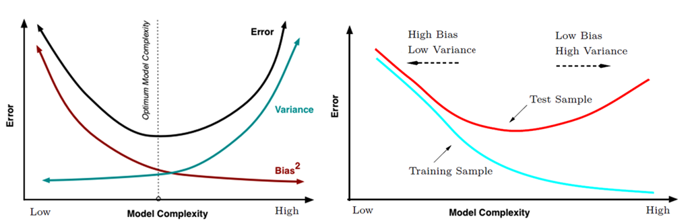

# 偏差bias与误差variance
有监督学习中，预测误差的来源主要有两部分，分别为bias与variance，模型的性能取决于bias与variance的tradeoff，理解 bias与variance有助于我们诊断模型的错误，避免over-fitting或者under-fitting。

对测试样本$x$，令$y_D$为$x$在数据集$D$中的标记，$y$为$x$的真实标记，$f(x;D)$为训练集$D$上学得模型$f$在$x$上的预测输出。
## 期望
学习算法的期望预测为
$$\bar{f}(x)=E_D[f(x;D)]$$

## bias偏差
期望输出与真实标记的差别称为偏差（bias）
$$bias^2(x)=(\bar{f}(x)-y)^2$$
偏差度量了学习算法的期望预测与真实结果的偏离程度，即刻画了算法本身的拟合能力。

## variance方差
使用样本数相同的不同训练集产生的方差为
$$var(x)=E_D[(f(x;D)-\bar{f}(x))^2]$$
方差度量了同样大小的训练集的变动所导致的学习性能的变化，即刻画了数据扰动所造成的影响。

## noise噪声
$$\epsilon^2=E_D[(y_D-y)^2]$$
噪声也就是真实标记与数据集中标记之间的差异，表达了当前任务上任何学习算法所能达到的期望泛化误差的下界，即刻画了问题本身的难度。

## 偏差-方差分解
周志华《机器学习》一书2.5章节有通过分解得到期望泛化误差为偏差、方差之和的证明$Err(f:D)=bias^2(x)+var(x)+\epsilon^2$，但个人认为那个证明有问题。

低偏差与低方差往往难以兼得。因为预测模型试图用有限的训练样本上去得到一个用来预测全数据集的模型，为了降低模型的误差率，就要尽量使模型在训练数据集上更加“准确”，这样做往往会增加 Model Complexity ，但却忽略模型在全数据集的泛化能力，模型在训练数据集的Bias 减少了，但是对于训练数据集中没有出现的数据，模型对其预测就会很不稳定，这样就会造成高 Variance ，这也就是常说的 over-fitting。[2]

然后网上有个关于解释偏差和方差的射箭的中靶图，个人认为那个图有点问题，它只适合解释期望和方差，对于这个问题它忽略了bias是绝对值，以及没有任何关于数据样本变化（扰动）的比喻。

## 参考
- [1] 周志华老师的书
- [2] [理解bias和variance](http://www.cnblogs.com/ooon/p/5711516.html)
