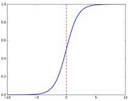
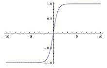
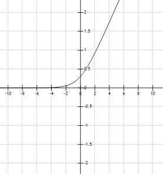
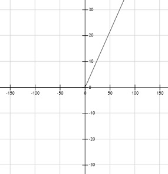
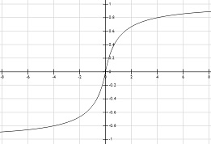
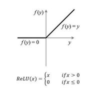
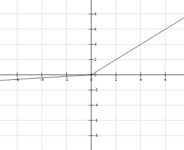
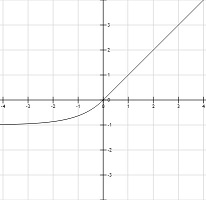

# 激活函数
## 概念[1] 
所谓激活函数（Activation Function），就是在人工神经网络的神经元上运行的函数，负责将神经元的输入映射到输出端。它们将非线性特性引入到我们的网络中。

如果不用激励函数，每一层输出都是上层输入的线性函数，无论神经网络有多少层，输出都是输入的线性组合，这种情况就是最原始的感知机（Perceptron）。

使用激活函数之后，激活函数给神经元引入了非线性因素，使得神经网络可以任意逼近任何非线性函数，这样神经网络就可以应用到众多的非线性模型中。

## 常见激活函数对比
| 函数名 | 公式 | 备注 |
| ----- | ----- | ----- |
| Sigmoid | $f(x)=\frac{1}{(1+e^{-x})}$ | 计算复杂度高，均值非0，梯度弥散 |
| Hard Sigmoid | $f(x)=\left\{\begin{aligned}&1& &x\gt2.5 \\&0.2*x+0.5&, &-2.5\le x\le 2.5 \\&0&, &x\lt-2.5\end{aligned}\right.$ | 相比sigmoid降低计算复杂度 |
| Softmax | $f(x,j)=\frac{e^{x_j}}{\sum_{k=1}^K(e^{x_k})}$ | 多用于多元分类输出 |
| Tanh | $f(x)=\frac{e^{x}-e^{-x}}{(e^{x}+e^{-x})}$ | 比Sigmoid强在均值0 |
| Softplus | $f(x)=\log(\exp(x)+1)$ | 可看作是连续可微的relu |
| Softsign | $f(x)=\frac{x}{abs(x) + 1}$ | 备注 |
| ReLU | $f(x)=max(0,x)$ | 正值无梯度饱和问题；计算快;负值输出0导致了稀疏和抗干扰，但均值非0增加训练难度 |
| PReLU | $f(x)=max(\alpha x, x), \alpha<1$ | 相比ReLU增加了负值的输出，使得均值尽量靠近0，同时复杂度低于ELU |
| ELU | $f(x)=\left\{\begin{aligned}&x&, &x\gt0 \\&\alpha(e^x-1)&, &x\le0\end{aligned}\right.$ | 可视为带弱BN的计算复杂度低的ReLU |
## Sigmoid
当用于输出层时，可用于回归或者二元分类
$$f(x)=\frac{1}{(1+e^{-x})}$$

缺陷：
1. 当输入稍微远离了坐标原点，函数的梯度就变得很小了，几乎为零。在神经网络反向传播的过程中，我们都是通过微分的链式法则来计算各个权重w的微分的。当反向传播经过了sigmod函数，这个链条上的微分就很小很小了，况且还可能经过很多个sigmod函数，最后会导致权重w对损失函数几乎没影响，这样不利于权重的优化，这个问题叫做梯度饱和，也可以叫梯度弥散。
2. 函数输出不是以0为中心的，这样会使权重更新效率降低。
3. sigmod函数要进行指数运算，计算复杂度高。

## Hard Sigmoid
sigmoid快速计算形式
$$ f(x)=\left\{
\begin{aligned}
&1&, &x\gt2.5 \\
&0.2*x+0.5&, &-2.5\le x\le 2.5 \\
&0&, &x\lt-2.5
\end{aligned}
\right.
$$

## Softmax
归一化指数函数。它能将一个含任意实数的K维向量  “压缩”到另一个K维实向量  中，使得每一个元素的范围都在  之间，并且所有元素的和为1。一般用于输出层，做多元分类。
$
f(x,j)=\frac{e^{x_j}}{\sum_{k=1}^K(e^{x_k})}
$

## Tanh
tanh是双曲正切函数，tanh函数和sigmod函数的曲线是比较相近
$$f(x)=\frac{e^{x}-e^{-x}}{(e^{x}+e^{-x})}$$

优点：
1. 整个函数是以0为中心

缺点：
1. 在输入很大或是很小的时候，输出都几乎平滑，梯度很小，不利于权重更新
2. 计算复杂度高

## Softplus
可粗略看作是连续可微的relu
$$f(x)=\log(\exp(x)+1)$$

## Softsign
$$f(x)=\frac{x}{abs(x) + 1}$$

 
## ReLU
Rectified Linear Unit

$$f(x)=max(0,x)$$

几个优点：
1. 在输入为正数的时候，不存在梯度饱和问题。
2. 计算速度要快很多。ReLU函数只有线性关系，不管是前向传播还是反向传播，都比sigmod和tanh要快很多。（sigmod和tanh要计算指数，计算速度会比较慢）
3. 当输入是负数的时候，ReLU是完全不被激活的，这样就造成了网络的稀疏性，并且减少了参数的相互依存关系，缓解了过拟合问题的发生,使其具备了抗干扰的能力

缺点：
1. 当输入是负数的时候，ReLU是完全不被激活的，这就表明一旦输入到了负数，梯度就会完全到0。
2. ReLU函数的输出要么是0，要么是正数，这也就是说，ReLU函数也不是以0为中心的函数。

## PReLU[5]
针对ReLU的一个改进型，在负数区域内，PReLU有一个很小的斜率，这样也可以避免ReLU死掉的问题。
$$f(x)=max(\alpha x, x), \alpha<1$$

优点：
1. 负数输入时，梯度不会完全为0
2. 复杂度相对elu低

缺点：
1. 当输入负值过大时，由于是线性的故抗干扰力不强

## ELU
Exponential Linear Unit，可视为带弱BN的计算复杂度低的ReLU
$$ f(x)=\left\{
\begin{aligned}
&x&, &x\gt0 \\
&\alpha(e^x-1)&, &x\le0
\end{aligned}
\right.
$$

优点：
1. elu由于其正值特性，可以像relu,lrelu,prelu一样缓解梯度消失的问题
2. 相比relu，elu存在负值，可以将激活单元的输出均值往0推近，达到 
batchnormlization（bn）的效果且减少了计算量
3. 输入为负数的情况下，是有一定的输出的，而且这部分输出还具有一定的抗干扰能力。负值时是一个指数函数，对于输入特征只定性不定量。 
4. 快于bn+relu

缺点：
1. 最终效果不如bn+relu

## SELU
带缩放的elu, scale和alpha用于调整均值跟方差
$$f(x)=scale * elu(x, \alpha)$$

# 哪个最好
cifar10上bn+relu(先bn再relu) > elu > prelu > elubn > relu

keras上內建实现的resnet50采用给的就是relu+bn

## 参考
- [1] [百科--激活函数](https://baike.baidu.com/item/%E6%BF%80%E6%B4%BB%E5%87%BD%E6%95%B0/2520792?fr=aladdin) 
- [2] [keras里内置的激活函数](https://keras.io/activations/#exponential) 
- [3] [几种常用激活函数的简介](https://blog.csdn.net/kangyi411/article/details/78969642) 
- [4] [激活函数（relu，prelu，elu，+BN）对比on cifar10]( https://blog.csdn.net/m0_37561765/article/details/78398098) 
- [5] [Delving Deep into Rectifiers:
Surpassing Human-Level Performance on ImageNet Classification](https://arxiv.org/pdf/1502.01852.pdf) 