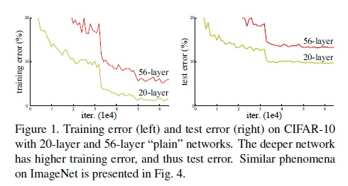
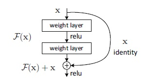
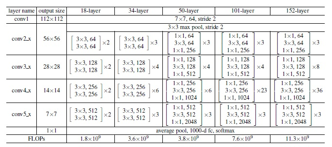

# ResNet
## 引言
何凯明等人在15年提出的一种网络模型，并以此获得ILSVRC2015分类任务的冠军，同时也是他们获得ImageNet detection，ImageNet localization，COCO detection和COCO segmentation等竞赛冠军的模型的基础。

当前的研究和竞赛结果表明神经网络的深度至关重要。

堆砌更多的layer从而得到更深的网络是容易，但训练深层的网络并不简单。导致这个现象的原因主要是梯度消失和梯度爆炸。先前的很多工作已经在较大程度上解决了这个问题：输入归一（normalized initialization）和中间层归一（BN）[2]。

除此之外，同时当网络变得更深的时候，网络反而会开始降级(degradation)————在训练集的错误率反而比浅的网络更高，具体如下图所示。

通过引进深度残差学习框架（deep residual learning framework.），作者解决了深度网络的降级问题。让堆叠的层去fit残差映射，而不是直接去fit一个期望的隐含的映射（故叫做残差网络）。作者没有证明这样做为什么能够带来模型训练上的优势，但是举了个极端例子：假如恒等映射是最优的，那么将残差部分push到0肯定比让一堆非线性层学会恒等网络来得简单。

可以通过带shortcut connections的前向网络来实现残差块，如下图。

事实上，作者不仅仅采用了恒等的shortcut(公式1)，而是混合使用了带线性投影的shortcut(公式2)。
$$y = F(x, {W_i}) + x \tag{$1$} $$
$$y = F(x; {W_i}) +W_sx \tag{$2$}$$

各种层数的ResNet如下所示：

## 参考
- [1] [原论文](thesis/Deep_Residual_Learning_for_Image_Recognition.pdf)
- [2] [BN论文](thesis/Batch_normalization_Accelerating_deep_Network_Training_Reducing_Internal_Covariate_Shift.pdf)