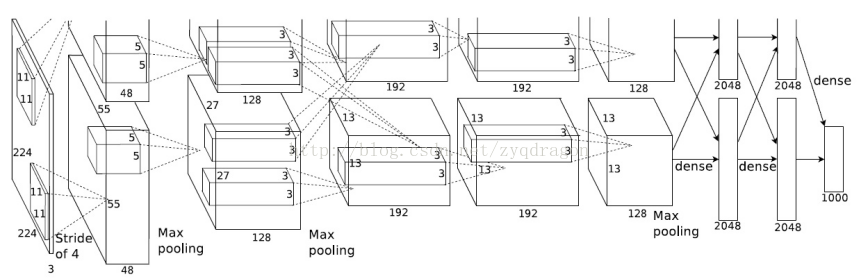

# AlexNet


特点：
- 深、宽
- Dropout
```
训练时使用Dropout随机忽略一部分神经元，防止过拟合，增加模型的泛化能力
```
- [ReLU激活函数](dl-activation.md)
- Local Response Normalization(LRN)
```
模仿上午神经系统的侧一直机制，对局部神经元的活动创建竞争机制，使得其中响应比较大的值变得相对更大，并抑制其他反馈较小的神经元，增强了模型的泛化能力
```
- 使用CUDA加速深度卷积网络的训练
- 使用数据增强