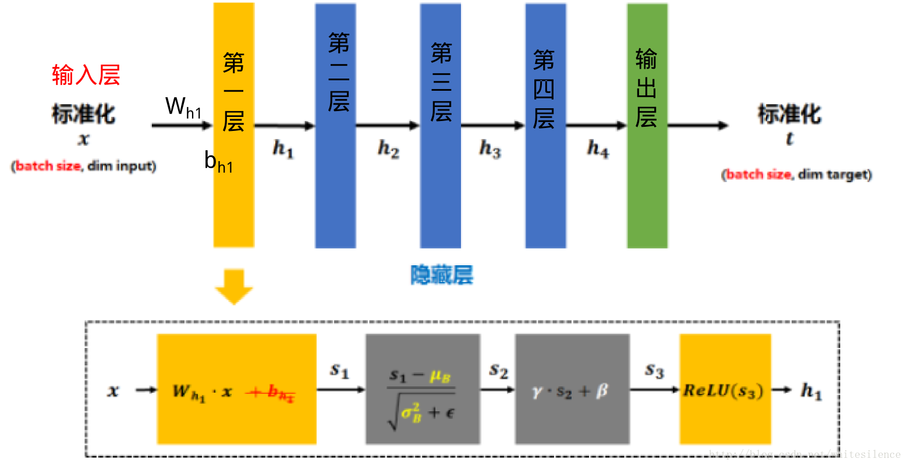
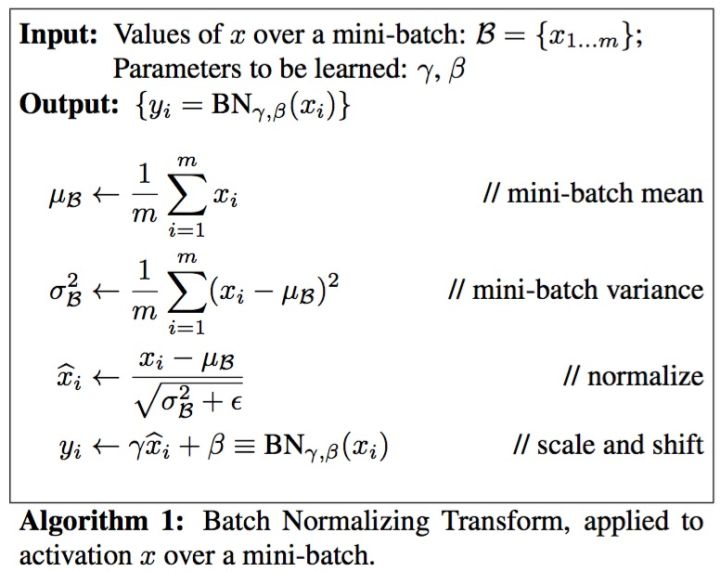

# 引言
# 特别的操作
## dropout
dropout的提出主要是为了训练中防止网络过拟合，其原理是随机丢掉某些连接，可以理解为每次只考虑不完整的输入，一般应用在前面几层，到后面几层时，特征图比较小，就不应该被丢失。在test时会关闭dropout。
现在基本不用dropout了，改用batch normalization。

## batch normalization
BN的提出还是为了克服深度神经网络难以训练的弊病。传统的神经网络，只是在将样本x输入输入层之前对x进行标准化处理（减均值，除标准差），以降低样本间的差异性。BN是在此基础上，不仅仅只对输入层的输入数据x进行标准化，还对每个隐藏层的输入进行标准化。[3]

0. 矩阵$x$先经过$W_{h_1}$的线性变换后得到$s_1$ (注：因为减去batch的平均值$\mu_B$后，b的作用会被抵消掉，所提没必要加入b了）

1. 将$s_1$ 再减去batch的平均值$mu_B$，并除以batch的标准差$\sqrt{\sigma_B^2+\epsilon}$得到$s_2$. $\epsilon$是为了避免除数为0时所使用的微小正数。  
其中$\mu_B=\frac{1}{m}\sum_{i=0}^mWx_i$, 
$\sigma_B^2=\frac{1}{m}\sum_{i=0}^m(Wx_i-\mu_B)^2$  
(注：由于这样做后$s_2$基本会被限制在正态分布下，使得网络的表达能力下降。为解决该问题，引入两个新的参数：$\gamma$,$\beta$. $\gamma$和$\beta$是在训练时网络自己学习得到的。）

2. 将$s_2$乘以$\gamma$调整数值大小，再加上$\beta$增加偏移后得到$s_3$
3. $s_3$经过激活函数后得到$h_1$

需要注意的是，上述的计算方法用于在训练过程中。在测试时，所使用的$\mu$和$\sigma$是整个训练集的均值$\mu$和方差$\sigma$. 整个训练集的均值$\mu$和方差$\sigma$的值通常是在训练的同时用移动平均法来计算的.

Internal Covariate Shift”: covariate shift就是分布不一致假设之下的一个分支问题，它是指源空间和目标空间的条件概率是一致的，但是其边缘概率不同，即：对所有$x\in \mathcal{X},P_s(Y|X=x)=P_t(Y|X=x)$，但是$P_s(X) \ne P_t(X)$. 对于神经网络的各层输出，由于它们经过了层内操作作用，其分布显然与各层对应的输入信号分布不同，而且差异会随着网络深度增大而增大，可是它们所能“指示”的样本标记（label）仍然是不变的，这便符合了covariate shift的定义。由于是对层间信号的分析，也即是“internal”的来由。[1]

谷歌研究人员认为他们用BN解决了ICS问题，但实际上他们解决的是防止梯度弥散的问题。BN中，是通过将activation规范为均值和方差一致的手段使得原本会减小的activation的scale变大。
因此通过克服BN解决了反向传播过程中的梯度问题（梯度消失和爆炸），同时使得不同scale的 w 整体更新步调更一致。[1]

Batch Normalization的加速作用体现在两个方面：一是归一化了每层和每维度的scale，所以可以整体使用一个较高的学习率，而不必像以前那样迁就小scale的维度；二是归一化后使得更多的权重分界面落在了数据中，降低了overfit的可能性，因此一些防止overfit但会降低速度的方法，例如dropout和权重衰减就可以不使用或者降低其权重。[2]

# 层
## 卷积层
### 1x1卷基层
可用来改变维度，一般通过在block（连续几个连接的层）前后加1x1卷积，前面的1x1卷积执行降维，后面的1x1卷积执行升维，从而达到降低模型参数数量的目的。

## 反卷积层

## 全连接层
### 带sigmoid的全连接
### 带softmax的全连接

# 层上操作
## 激活函数
## 池化pool
全局最大池化、全局平均池化、最大池化、平均池化

# 参考
[1] [深度学习中 Batch Normalization为什么效果好](https://www.zhihu.com/question/38102762)  
[2] [bn阅读笔记](https://blog.csdn.net/happynear/article/details/44238541)  
[3] [深度学习中的Batch Normalization](https://blog.csdn.net/whitesilence/article/details/75667002)  