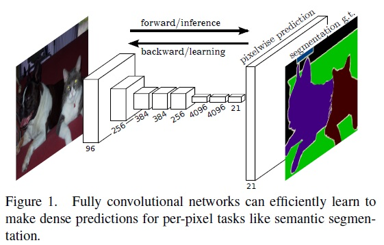
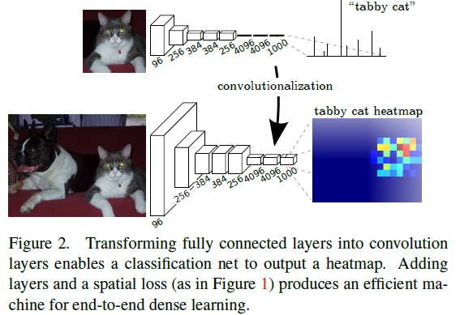
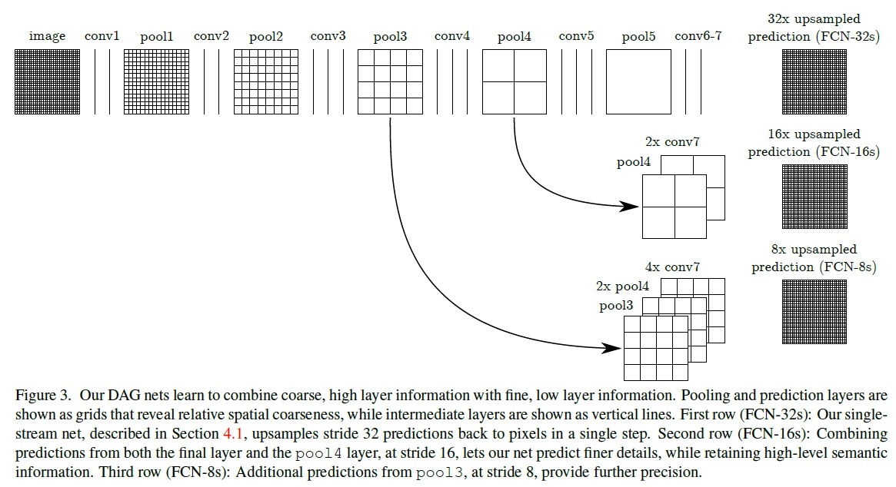

# 引言
Jonathan Long/Evan Shelhamer等人提出的将卷积神经网络运用于语义分割的方法，差不多是神经网络在这个领域的开山作。

作者提出了通过在分类网络中将“全连接层”转变为“卷积层”，从而得到“全卷积网络”，该全卷积网络能够有效地学习到逐像素的稠密预测的能力，例如语义分割。同时作者发现采用skip结构，将浅层与深层输出结合，能够获得更为精准的效果。



# 特点
- 全卷积网络
- 可接受任意尺寸的图像
```
因为全连接层受限于输入的特征尺寸，也就说它要求前一层的输出w*h*d里的w和h必须是固定的值，而卷积层没有这种限制
```
- 适配各分类器改造出用于稠密预测的模型
```
对于cn特征的size变化有H*W=>f(H1,stride1,valid1)*f(W1,stride1,valid1)=>f(H2,stride2,valid2)*f(W2,stride2,valid2)=>f(H3,stride3,valid3)*f(W3,stride3,valid3)=>1（这里经过了全卷积，个人认为不是1*1而是1）；
对于fcn特征的size变化有H*W=>H/2*W/2=>H*W=>H/4*W/4=>H/16*W/16=>H/32*W/32；（并非每层都会有变化）

如上每过一个filter尺寸是在原图尺寸上缩减，而非产生一个固定尺寸的特征图，故这是可以接受任意尺寸图像的；到1/32时得到既是高维特征图——heatmap
```

- 采用反卷积做上采样（从粗糙的输出feature map至稠密的像素），从而达到逐像素预测的目的
- 提出对于稠密预测任务，全图片训练比path-wise的训练更快、更好
- 采用skip结构，联合浅层和深层输出，从而达到更好的预测效果  


# 不足
- 产生的结构仍旧不够精细


# 参考
[1] [原论文](thesis/FullyConvolutionalNetworksforSemanticSegmentation.pdf)<br/>