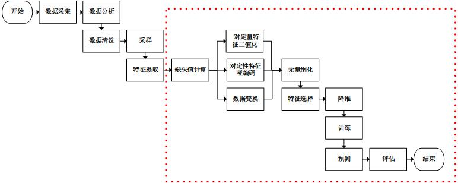

# 数据预处理

## 1. 为什么进行数据处理<sup>[1]</sup>
真实世界数据通常：
- 不完备：缺少属性值，缺少特定的兴趣属性，或者只包含聚合的数据；
- 噪音：包含错误或者离群值；
- 前后不一致：编码或者名字里包含差异；
数据预处理的任务：
- 数据清洗：填充缺失值，平滑噪音瞬狙，鉴别、移除非离群点，解决不一致问题；
- 数据集成：使用多数据库源，数据cube或者文件；
- 数据转换：normalization and aggregation；
- 数据精简：缩减volume但是产生相似或者相同的分析结果
- 数据离散化：使用名词替换数值属性

## 2. 数据清洗<sup>[1]</sup>
1. 填充缺失值
   1.1 无视所在原组
   1.2 使用属性均值、所在类别的属性均值进行填充
   1.3 使用学习算法预测缺失值，例如贝叶斯或者决策树
2. 鉴别离群点以及平滑噪音数据
   2.1 binning（垃圾箱）：对属性值进行排序并分割放入bins，使用bins的均值或者中位数或者边界数进行平滑
   2.2 聚类：对值进行聚类，然后检测和移除离群点
   2.3 回归：使用回归函数对数据进行平滑
3. 纠正不一致的数据：使用领域知识或者专家决策

## 3. 数据转换
### 3.1 Scale和Normalization<sup>[3]</sup>
#### min-max scale
$$x_{scaled}=\frac{x-x_{Min}}{x_{Max}-x_{Min}}$$

- 当有新数据加入时，可能导致 max 和 min 发生变化，需要重新定义。
- 如果max和min不稳定，很容易使得归一化结果不稳定，使得后续使用效果也不稳定。实际使用中可以用经验常量值来替代max和min

```
# SciKit-Learn实现
min_max_scaler = preprocessing.MinMaxScaler()
X_train_minmax = min_max_scaler.fit_transform(X_train)
```

#### Z-score normalization
$$x_{normalization}=\frac{x-\mu}{x-\sigma}$$
经过处理的数据符合标准正态分布，即均值为 0，标准差为 1 。其中μ为所有样本数据的均值，σ为所有样本数据的标准差。

标准化的过程为两步：去均值的中心化（均值变为0）；方差的规模化（方差变为1）
```
# SciKit-Learn实现
X_scaled = preprocessing.scale(X)
```

#### L1 L2正则化
对每个样本计算其p-范数，然后对该样本中每个元素除以该范数
$$∥X∥_p=((|x_1|)^p+(|x_2|)^p+...+(|x_n|)^p)^\frac{1}{p}$$

```
X_normalized = preprocessing.normalize(X, norm='l2')
```
### 3.2 编码
#### onehot
独热码，在英文文献中称做 one-hot code, 直观来说就是有多少个状态就有多少比特，而且只有一个比特为1，其他全为0的一种码制。
```
enc = preprocessing.OneHotEncoder()
enc.fit([[0, 0, 3], [1, 1, 0], [0, 2, 1], [1, 0, 2]])    # fit来学习编码
enc.transform([[0, 1, 3]]).toarray()
# 输出[[ 1.,  0.,  0.,  1.,  0.,  0.,  0.,  0.,  1.]]
# 10对应0；010对应1;0001对应3
```
#### label encoder
对不连续的数字或者文本进行编号
```
le = LabelEncoder()
le.fit([1,5,67,100])
le.transform([1,1,100,67,5])
# 输出： array([0,0,3,2,1])
```

### 3.3 Aggregation聚合
### 3.4 Generalization归纳
### 3.5 Attribute construction属性构造
替换或者增加新属性

## 参考
- [1] [康涅狄格州立大学Data preprocessing](http://www.cs.ccsu.edu/~markov/ccsu_courses/DataMining-3.html)
- [2] [预处理数据的方法总结](https://blog.csdn.net/weixin_40807247/article/details/82793220)
- [3] [标准化的实现](https://blog.csdn.net/u011092188/article/details/78174804)
- [4] [OneHotEncoder独热编码和 LabelEncoder标签编码](https://www.cnblogs.com/king-lps/p/7846414.html)